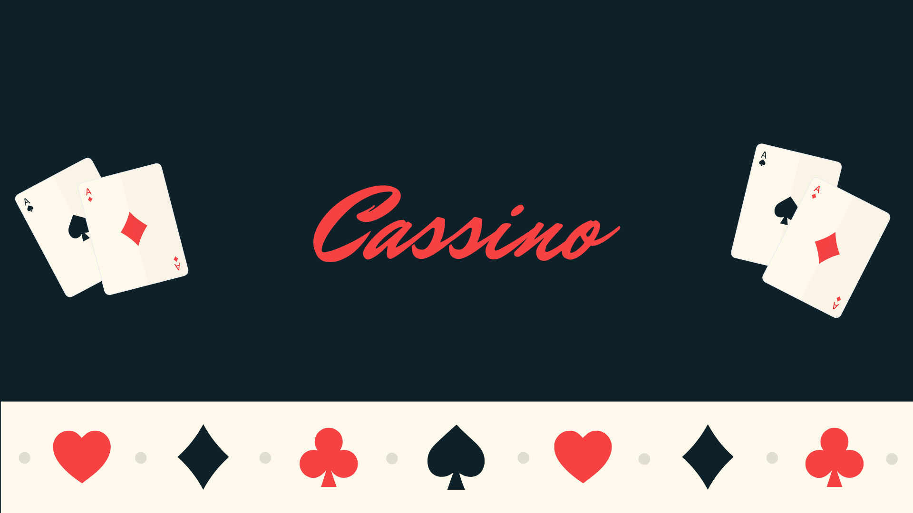

- 👀 I’m interested in Machine Learning, Data Science, Computer Vision, Algorithms and Computer Science
- 🌱 I’m currently learning Tensorflow and Operating Systems
- 💞️ I’m looking to collaborate on any open source repository that I can connect to.
- ⚡ Fun fact: I love Souls Games and you guessed it, **poker**.
- 

<!---
KingCassino/KingCassino is a ✨ special ✨ repository because its `README.md` (this file) appears on your GitHub profile.
You can click the Preview link to take a look at your changes.
--->
